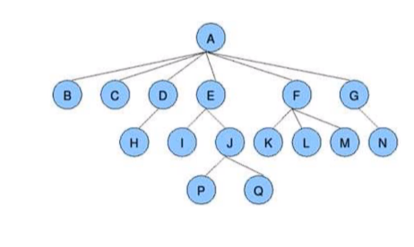
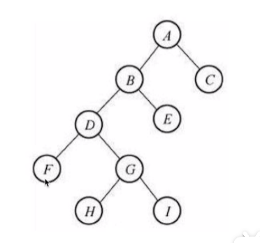
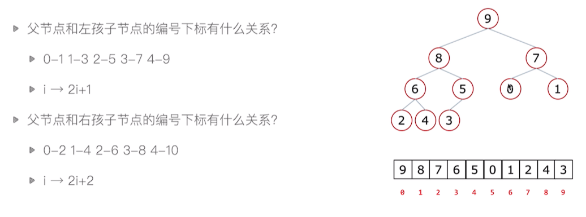
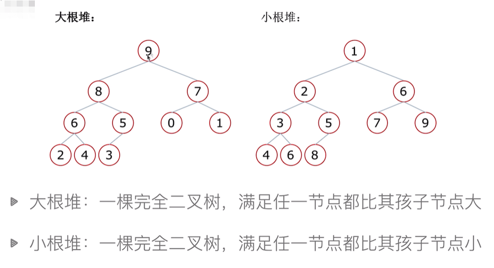

# 堆排序

## 树 

- 一种数据结构 例如：文件目录结构
- 树是一种可以递归定义的数据结构
- 树是由n个节点组成的集合
    - 如果n=0，那这是一棵空树；
    - 如果n>0，那存在1个节点作为树的根节点，其他节点可以分为m个集合，每个集合本身又是一棵树。

- 一些概念
    - 根节点、叶子节点：根节点为最上层父节点；叶子节点为没有孩子节点的节点
    - 树的深度（高度）：层数
    - 孩子节点/父节点
    - 树的度：单个父节点，孩子节点最大的数
    - 子树


## 二叉树

度不超过2的树为二叉树，每个节点最多有两个孩子节点，两个孩子节点被区分为左孩子节点和右孩子节点。

###### 完全二叉树

- 满二叉树：一个二叉树，如果每一层的节点数都达到最大值，则这个二叉树就是满二叉树。
- 完全二叉树：叶子节点之恩那个出现在最下层和次下层，并且最下面一层的节点都集中在该层最左边的若干位置的二叉树

###### 二叉树存储方式
- 链式存储方式
    - TODO见后续数据结构部分
- 顺序存储方式
    - 列表
        - 父节点 --- 左孩子结点
        i -> 2i+1
        - 父节点 --- 右孩子节点
        i -> 2i+2




## 堆

- 一种特殊的完全二叉树
    - 大根堆：一颗完全二叉树，满足任一节点都比其孩子节点大
    - 小根堆：一颗完全二叉树，满足任一节点都比其孩子节点小

###### 堆的向下调整
假设：节点的左右子树都是堆，但自身不是堆。通过一次向下调整，可以变换成堆。

##### 堆排序过程
1. 构造堆
2. 得到堆顶元素，为最大元素
3. 去掉堆顶，将堆最后一个元素放到堆顶，此时可以的通过一次向下调整重新使堆有序
4. 堆顶元素为第二大元素
5. 重复步骤3，直到堆为空

- 堆的向下调整的实现
```java
    /**
     * 向下调整
     * @param li     堆本体数组
     * @param low    当前区间根节点
     * @param height 当前区间叶子节点
     */
    public void sift(int[] li, int low, int height) {
        int i = low;            // i代表当前区间根节点
        int j = i * 2 + 1;      // j代表当前区间根节点i的左孩子节点
        int temp = li[low];     // temp保存要向下调整的根节点值
        while (j <= height) {   // 如果j不超过最后的叶子节点则可以继续
            if ((j + 1) <= height && li[j + 1] > li[j]) {       // 如果i有右孩子节点，切值大于左孩子节点
                j += 1;         // j指向有孩子节点
            }
            if (li[j] > temp) { // 如果数值较大的孩子节点大于要调整的根节点的值
                li[i] = li[j];  // 将数值较大的孩子节点的值放到根节点
                i = j;          // 根节点i指向数值较大的孩子节点位置
                j = i * 2 + 1;  // 指向当前i的左孩子节点
            } else {            // 如果当前孩子节点的值小于要调整的根节点的值
                li[i] = temp;   // 将值赋给当前i的位置
                break;
            }
        }
        li[i] = temp;           // 当前i没有是叶子节点，跳出循环将向下调整的值赋予i下标
    }
```

- 堆排序的实现
```java
    /**
     * 大根堆排序，升序排列
     * @param li 目标数组
     */
    public void heapSort(int[] li) {
        int n = li.length;
        // 1.构建堆，从最后一个非叶子节点开始，逆向向下调整
        for (int i = (n - 2) / 2; i >= 0; i--) {// 最后一个叶子节点下标为i，其父节点=(i-1)/2
            sift(li, i, n - 1);// low 为最后一个叶子节点， height可以一直为堆最后一个元素
        }
        // 2.逐个出数
        for (int i = n - 1; i >= 0; i--) {
            int temp = li[0];       // 交换根节点（最大值）和末尾位置的值
            li[0] = li[i];
            li[i] = temp;
            sift(li, 0, i - 1); // height-1然后做一次向下调整，继续下一次循环，完成逐个出数，直到height指向根节点
        }
    }
```
- 时间复杂度 O(n*logn)
